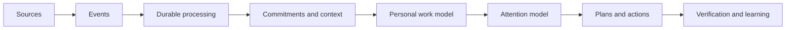
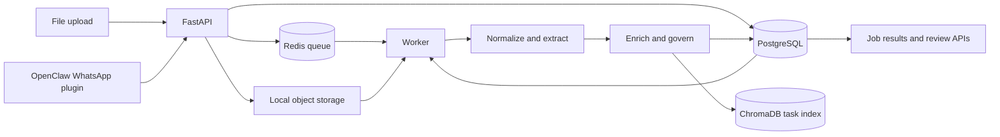
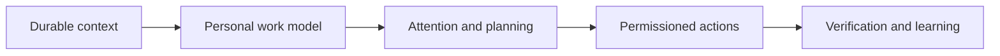

# Flowstate

Flowstate is an AI-native personal attention and workflow system that turns scattered activity into durable, traceable work context.

Work rarely begins as a clean task. It arrives through messages, documents, meetings, deadlines, requests, calendars, and project systems. The context needed to act is split across those sources, while most productivity tools expect the user to reconstruct it manually.

Flowstate is being built to observe that activity, preserve the original evidence, extract structured commitments and tasks, and model how work should compete for attention over time. The repository currently contains the durable ingestion and processing foundation for that direction; attention modelling, planning, and agent execution remain future work.

<!-- Add Flowstate Attention Graph screenshot here -->

## Why Flowstate

Existing task systems are good at storing work that someone has already identified and entered. They do not usually perform the translation from an informal request, conversation, or document into structured work while retaining why that work exists.

Flowstate is intended to become that translation layer: converting activity into durable context, linking derived work back to its source, and maintaining a personal model of commitments rather than another disconnected task list.

## The Core Idea

The long-term loop is:



Today, the repository implements the beginning of this loop: source ingestion, durable jobs, extraction, enrichment, provenance, persistence, review, and result retrieval. It does not yet implement a personal work model, attention scoring, planning, autonomous actions, or learning.

## Current Status

### Implemented

- A FastAPI upload endpoint for WhatsApp text exports, Discord export JSON, PDF, DOCX, PNG, and JPG inputs. Files are stored on the local filesystem and represented by durable processing jobs.
- A PostgreSQL model and Alembic migrations for jobs, Events, Commitments, Tasks, graph edges, and human review decisions. Records and reads are scoped by the current MVP tenancy key, `team_id`.
- A Redis-backed worker with database-first job creation, atomic queued-to-running claims, lifecycle timestamps, recorded failures, explicit retry support, and per-attempt publication deduplication.
- Deterministic normalization for supported file types and canonical connector Events.
- Ollama-based task extraction with JSON Schema validation, bounded batching, explicit transport failures, confidence scores, exact source snippets, and stable source references.
- Deterministic deadline normalization, limited historical owner inference, and ChromaDB-backed duplicate-candidate lookup and task embedding storage.
- Transactional persistence of a source Event, a source-level Commitment, extracted Tasks, and provenance/dependency edges. Stable IDs make downstream persistence idempotent, and dependency cycles are rejected before writes.
- Confidence-based governance, a team-scoped review queue, immutable approve/reject decisions, and eligibility filtering for approved tasks.
- Job status and result APIs that return the persisted Event, Commitment, Tasks, and graph edges after processing.
- An OpenClaw plugin and inbound adapter for WhatsApp text. The bridge is loopback-only, HMAC-signed, rejects stale/outbound/invalid events, preserves the raw payload, and handles redelivery without duplicating the canonical Event or job.
- Deterministic NetworkX DAG construction, cycle validation, longest-path calculation, and simple bottleneck detection.

### In Progress

- Live demo wiring and operational validation of the OpenClaw WhatsApp bridge. The repository contains the plugin, ingress route, smoke test, and integration tests; installation into a running OpenClaw gateway is manual.
- Connector coverage. WhatsApp text is the only live OpenClaw channel accepted today. Discord can be normalized from an uploaded export, but live Discord ingestion is not implemented.
- Enrichment depth. Owner inference can reuse an exact historical task description, but persisted speaker-frequency inference is still a stub. Duplicate detection is a basic derived-index check, not a learned personal work model.
- Memory. ChromaDB currently stores and queries per-team task embeddings; the durable semantic memory and retrieval engine described in the product direction does not exist yet.
- Product UI. `frontend/` is a React/Vite scaffold and does not yet contain a Flowstate dashboard or attention graph.

### Planned

- A personal workload and preference model with persistent context across sources.
- An attention model informed by effort, importance, deadlines, dependencies, schedule availability, historical behavior, and context-switching cost.
- Richer commitment grouping, dependency modelling, critical-path reasoning, and cross-source retrieval.
- Planning, permissioned agent execution, action verification, and feedback-driven learning.
- Broader live connector support, including Discord and additional communication, calendar, document, and project systems.
- Approval and permission controls around external actions, plus an installable, productized runtime.

## Architecture

The current system has two ingestion paths: local file uploads and authenticated WhatsApp text events forwarded by a local OpenClaw plugin. Both converge on the same durable job and worker pipeline.



PostgreSQL is authoritative for processing state and structured activity. Redis transports job identifiers and payloads; ChromaDB is a rebuildable derived index. External connector details remain behind the connector adapter boundary, while core activity persistence uses canonical domain objects.

Future direction, not current architecture:



See the [architecture decisions](./docs/adr/) and [OpenClaw bridge design](./docs/openclaw-inbound-bridge.md) for the deeper constraints.

## Durable Processing Spine

The processing spine is designed so accepted work remains inspectable when a queue, model, vector store, or worker step fails. Flowstate creates a database job before publication, publishes each attempt once, atomically claims only queued jobs, and records running, completed, or failed state with attempt counts and timestamps.

Processing writes the Event, Commitment, Tasks, and graph edges in one relational transaction. Derived IDs are stable for a job, so a retry after a later failure can reuse already-persisted activity instead of creating another copy. Connector acceptance similarly stores the canonical Event and its single job before attempting Redis publication. This provides durable, at-least-once processing semantics; it does not claim distributed exactly-once delivery.

The relevant decisions are documented in [ADR 004](./docs/adr/004-commitment-central-domain-object.md), [ADR 006](./docs/adr/006-team-id-tenancy.md), and [ADR 007](./docs/adr/007-openclaw-inbound-bridge.md).

## Demo Scope

The immediate demo is intended to prove that a real application message can cross a connector boundary and become inspectable, structured work without losing its source:

```text
WhatsApp text
→ OpenClaw plugin
→ authenticated Flowstate ingress
→ durable Event and job
→ worker extraction and enrichment
→ Commitment, Tasks, and provenance
→ job results API
```

That path is implemented for inbound WhatsApp text, subject to a locally configured OpenClaw gateway, PostgreSQL, Redis, ChromaDB, and Ollama. Live Discord ingestion and the Attention Graph UI are the next demo-facing pieces, not completed capabilities.

<!-- Add demo GIF here -->

<!-- Add Attention Graph screenshot here -->

<!-- Add task/source provenance screenshot here -->

## Attention Model

A deadline calendar says when something is due. Flowstate is intended to model when that commitment should demand attention. A request such as “video due tomorrow” should affect today's workload because the work must happen before the deadline.

The current implementation stores and normalizes deadlines and persists task dependency edges, but it does not calculate attention scores or allocate work against a schedule. Planned inputs include deadline proximity, estimated effort, importance, dependencies, schedule availability, historical behavior, and context-switching cost.

The planned learning loop also covers unfamiliar work: Flowstate can ask the user for effort or importance when it lacks a reliable prior, then reuse that answer for sufficiently similar future work. This interaction and similarity-based learning behavior are not implemented today.

## Repository Structure

```text
flowstate/
├── backend/
│   ├── api/                  # FastAPI ingress, jobs, results, enrichment, and review routes
│   ├── core/                 # Implemented activity persistence and graph algorithms
│   ├── db/                   # SQLAlchemy records, repositories, and transaction boundaries
│   ├── extraction/           # Schema-enforced Ollama task extraction
│   ├── enrichment/           # Ownership, deadline, and duplicate processing
│   ├── governance/           # Confidence routing and human review lifecycle
│   ├── infrastructure/       # Connector boundary and OpenClaw bridge
│   ├── ingestion/            # Upload acceptance and durable queue publication
│   ├── models/               # Canonical domain objects and HTTP schemas
│   ├── preprocessing/        # File and canonical Event normalization
│   └── worker.py             # Redis consumer and processing orchestration
├── alembic/                   # PostgreSQL schema migrations
├── docker/                    # Local PostgreSQL, Redis, and ChromaDB services
├── docs/                      # ADRs and connector operating guide
├── frontend/                  # React/Vite scaffold; product UI is not implemented
├── inference/                 # Ollama helper scripts and notes
├── scripts/                   # Smoke, evaluation, and development utilities
└── tests/                     # Unit, integration, and fixture coverage
```

## Running Locally

### Prerequisites

- Python 3.10 or newer
- Docker with Compose for PostgreSQL, Redis, and ChromaDB
- Ollama with the `mistral` model for real extraction
- Tesseract OCR only when processing PNG or JPG uploads
- Node.js and npm only for the current frontend scaffold
- OpenClaw `2026.9.4` or compatible only for the live WhatsApp bridge

### Install and configure

```bash
python3 -m venv .venv
.venv/bin/python -m pip install --upgrade pip
.venv/bin/python -m pip install -r requirements.txt
cp .env.example .env
set -a
source .env
set +a
```

The checked-in defaults target local services. Review `.env.example` before use; its database password is a development default. `OBJECT_STORE_PATH` defaults to `./storage/objects` and is created by the upload endpoint.

### Start the backend pipeline

```bash
docker compose -f docker/docker-compose.yml up -d postgres chromadb redis
ollama pull mistral
ollama serve
```

With those services running, use separate terminals from the repository root:

```bash
# Apply the PostgreSQL schema
.venv/bin/python -m alembic upgrade head

# Start the API on loopback
.venv/bin/uvicorn backend.api.main:app --host 127.0.0.1 --port 8001 --reload

# Start the Redis worker
.venv/bin/python -m backend.worker
```

The API root is `http://127.0.0.1:8001/`; interactive API documentation is available at `/docs`.

The worker loads the sentence-transformer model on first use and calls Ollama and ChromaDB during real processing. Model downloads and initial startup can therefore take time.

### Optional frontend scaffold

```bash
cd frontend
npm install
npm run dev
```

Vite prints the development URL, normally `http://localhost:5173`. This currently serves the starter screen, not a Flowstate product UI.

### Optional OpenClaw WhatsApp bridge

The bridge requires a shared `FLOWSTATE_BRIDGE_SECRET`, a `FLOWSTATE_TEAM_ID`, and an OpenClaw gateway configured to emit WhatsApp `message_received` hooks. Installation is intentionally manual. Follow [the OpenClaw inbound bridge guide](./docs/openclaw-inbound-bridge.md), which includes the exact plugin commands, environment, smoke test, and live verification steps.

## Testing

The automated suites replace external services with isolated databases, controlled queues, and model/vector substitutes. They cover extraction validation and provenance, deadline handling, job publication and lifecycle behavior, transaction rollback, retry idempotency, graph-cycle rejection, review decisions, team isolation, upload-to-results processing, and the signed OpenClaw ingress path.

```bash
# Entire automated suite
.venv/bin/python -m pytest tests/unit tests/integration -v --tb=short

# Faster unit suite
.venv/bin/python -m pytest tests/unit -q

# Integration suite
.venv/bin/python -m pytest tests/integration -v --tb=short

# Test discovery only
.venv/bin/python -m pytest --collect-only -q
```

The automated suite mocks the Ollama HTTP boundary; there is currently no
separate live-model test in `tests/`. See [testing.md](./testing.md) for the
testing contract and infrastructure checks.

## Engineering Documentation

- [BUILDLOG.md](./BUILDLOG.md) preserves the full chronological implementation history, debugging notes, architectural changes, and validation record formerly kept in this README.
- [Architecture Decision Records](./docs/adr/) document the accepted database/graph, adapter, domain, LLM, tenancy, and inbound bridge decisions.
- [OpenClaw inbound bridge guide](./docs/openclaw-inbound-bridge.md) covers the current live connector boundary and operating procedure.
- [Testing guide](./testing.md) documents hermetic test commands and optional infrastructure verification.
- [Inference setup notes](./inference/README.md) describe the repository's Ollama helper scripts; note that some model naming in that older guide differs from the current extractor default.
- [AGENTS.md](./AGENTS.md) records repository architecture and contribution constraints for coding agents.

## Roadmap

| Stage | Status |
|---|---|
| 1. Durable Core | Implemented for the current upload and connector job paths |
| 2. Live Connector Ingestion | WhatsApp text bridge implemented; live validation and Discord remain in progress/planned |
| 3. Commitment + Attention Intelligence | Basic commitment/provenance graph implemented; attention modelling planned |
| 4. Personal Work Model | Planned |
| 5. Planning / Agent Runtime | Planned |
| 6. Productization + Broader Connectors | Planned |

## Project Status

Flowstate is under active development. This repository is an evolving MVP and product-engineering research effort, not a finished or production-ready release. The durable processing foundation is real and tested; the broader product vision remains deliberately separated from what the code can do today.
